## Jobsheet 5
Muhammad Zuhdi Yudadharma  
244107020017  
TI - 2F

## JOBSHEET INSTALASI

## langkah-langkah

1. migrate database  
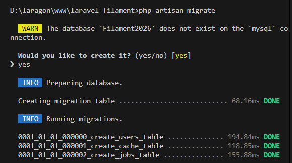

2. install filament v4  
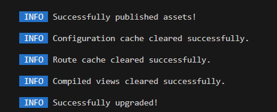

3. create user admin  
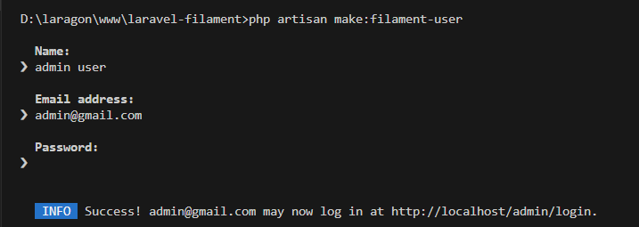

4. running APK  
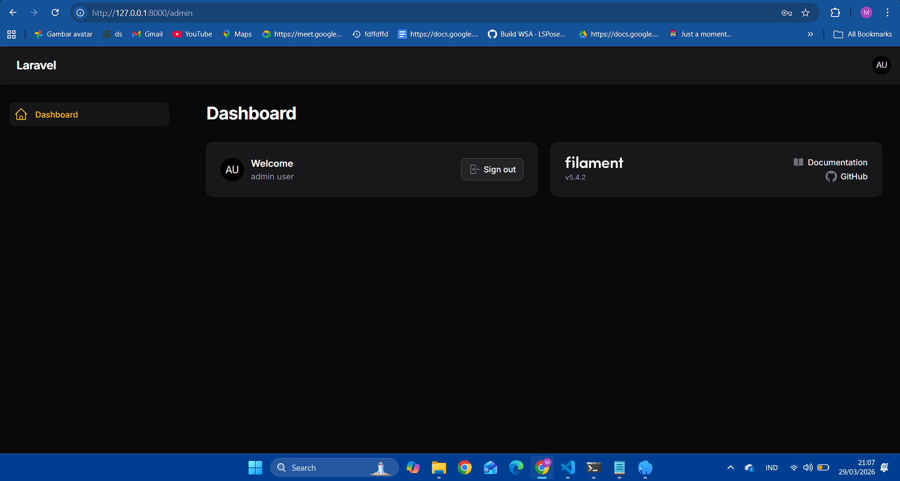

5. make 2 admin  
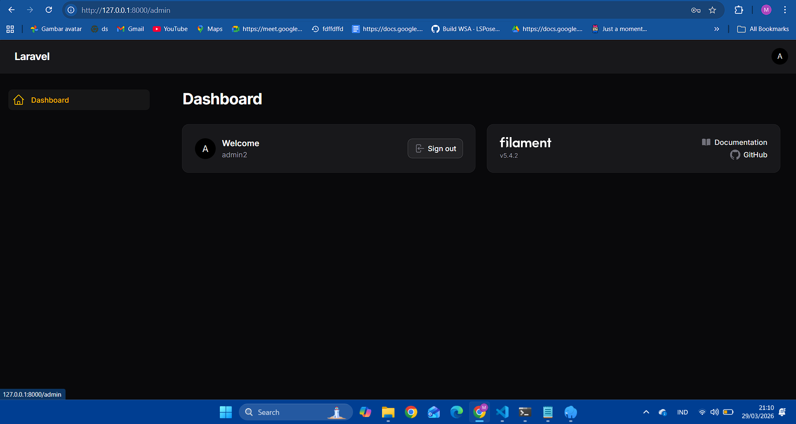

-------------------------------------------------

## JOBSHEET CRUD

## langkah-langkah

1. make resource user 
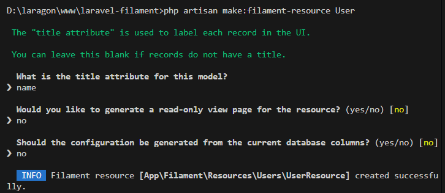
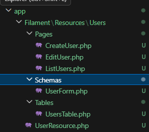
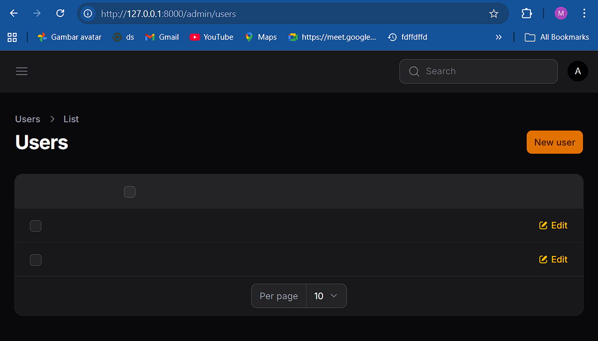

2. view create  
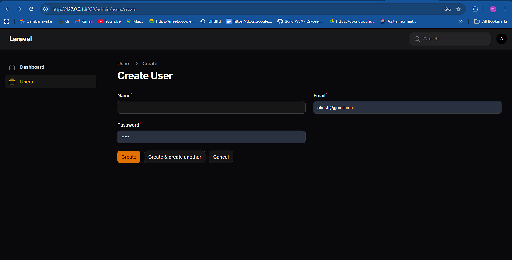

3. input create  
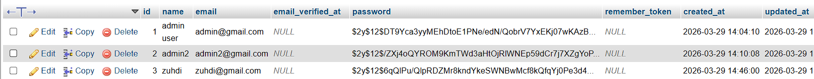
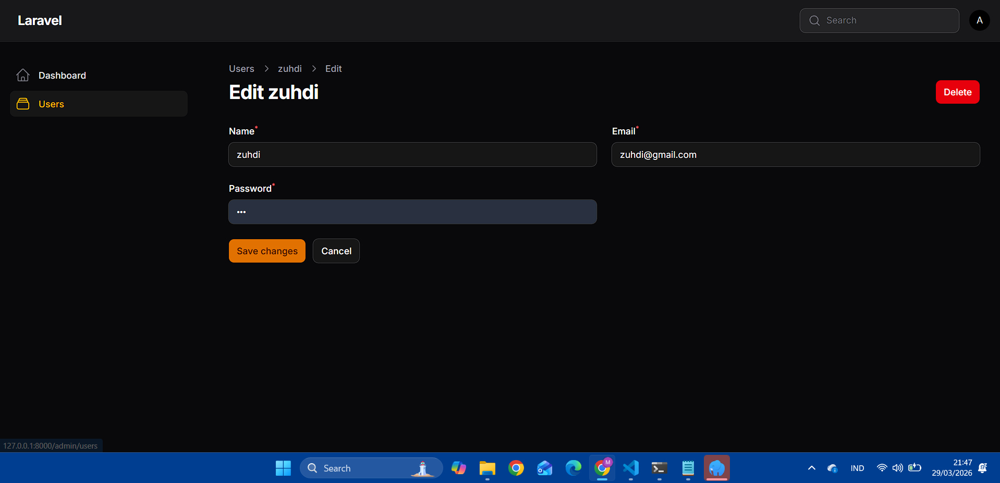

4. view data 
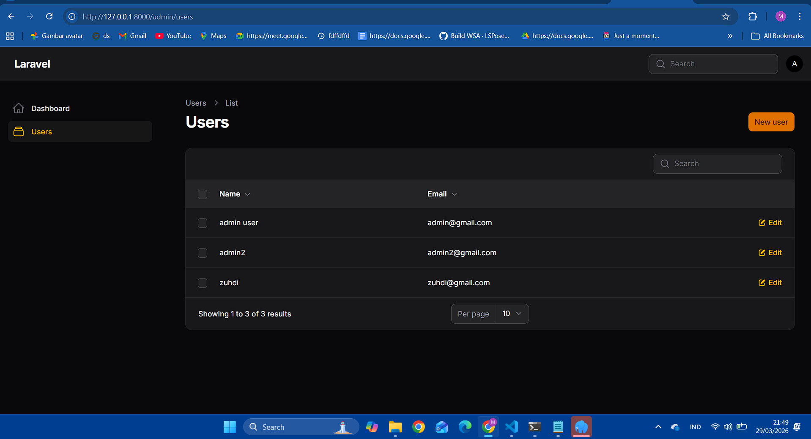

5. change icon 
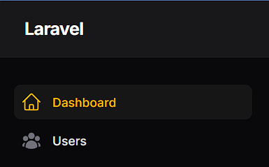

6. validasi email, password  
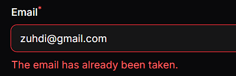
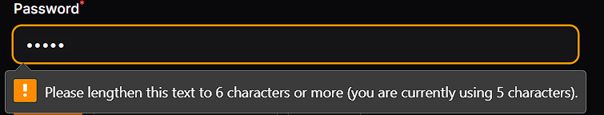

7. add table create at, change icon 
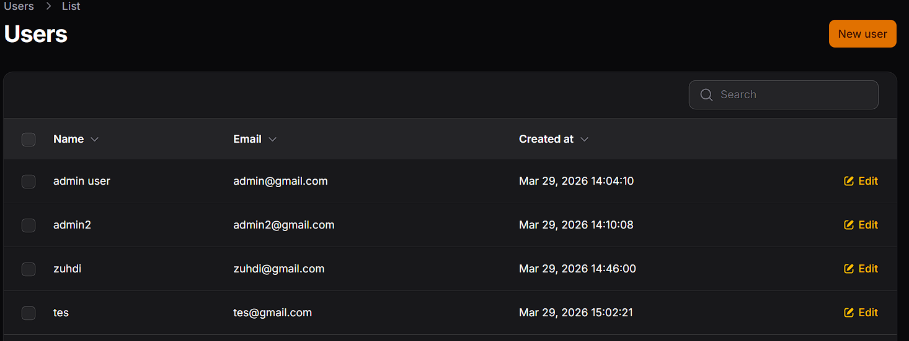
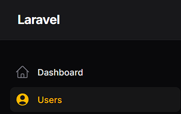

-----------------------------------------------

## JOBSHEET Migrasi dan Model

## langkah-langkah

1. generate model categories 
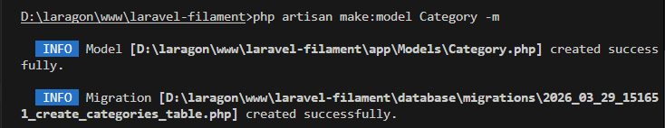

2. generate table categories 
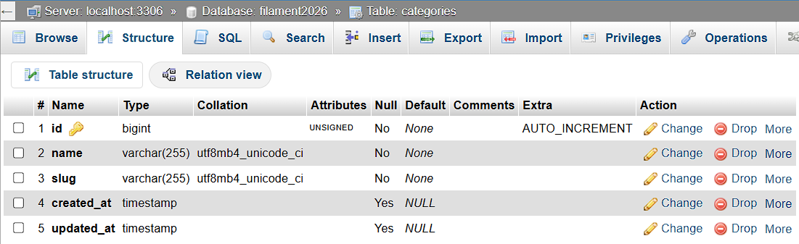

3. generate model post 
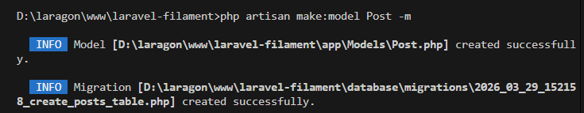

4. desain structure table post 
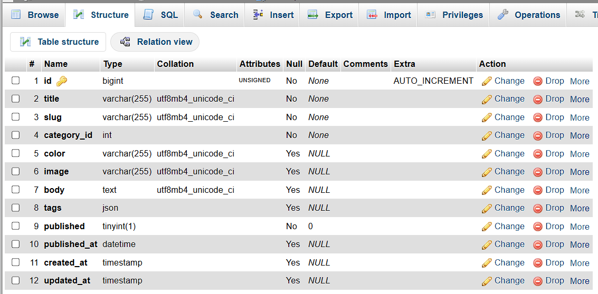

5. mengatur model post 
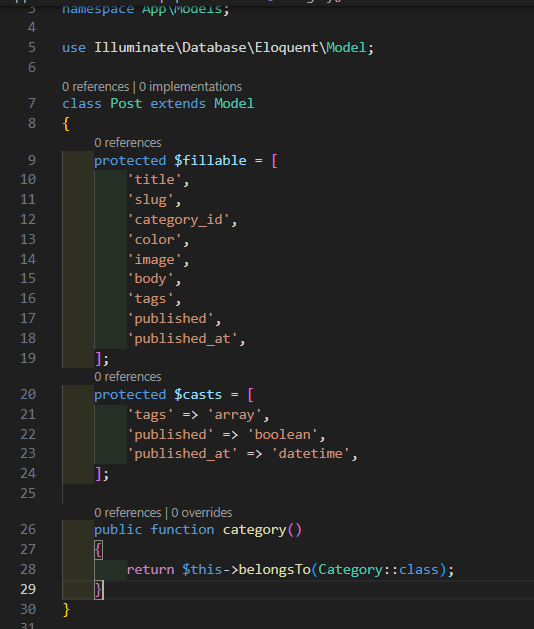

6. make resource category in filament 
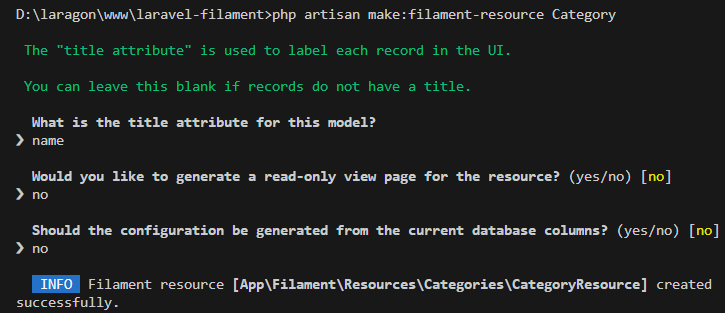
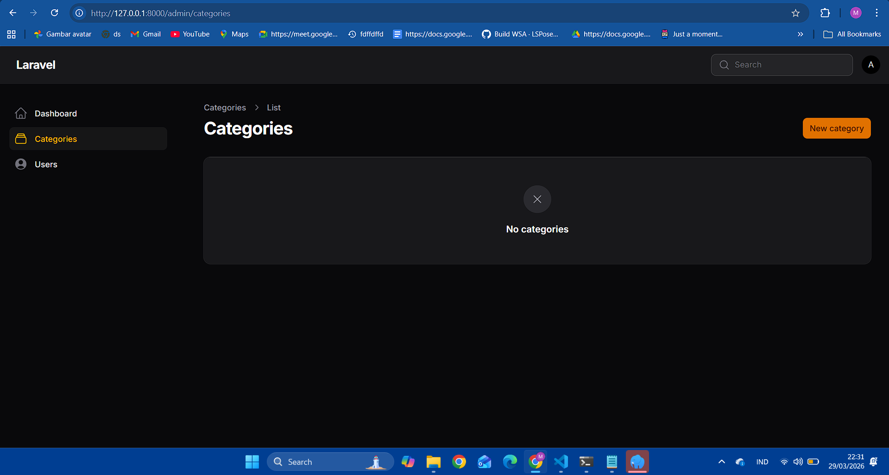

7. edit form category 
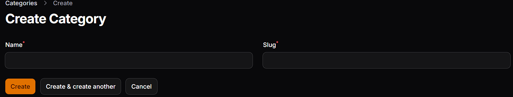

8. edit table category 
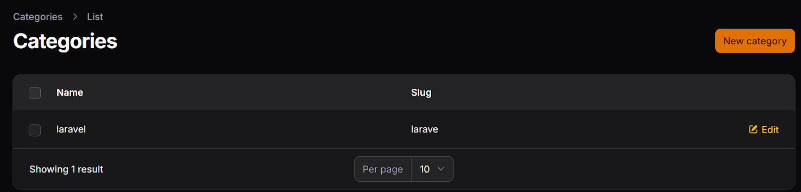

9. add 3 category 
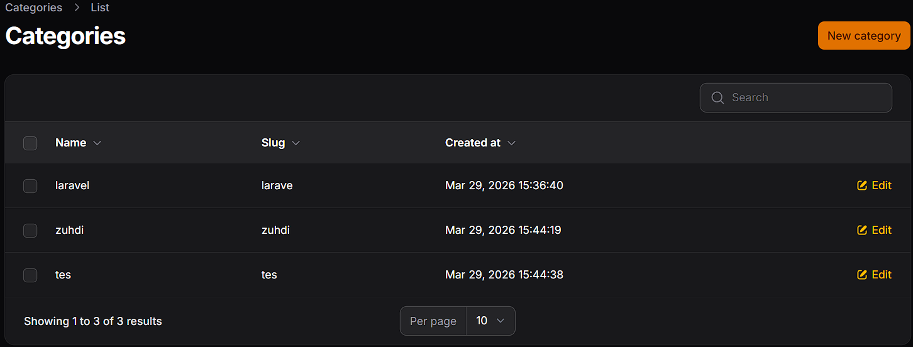

10. add validate slug unique 
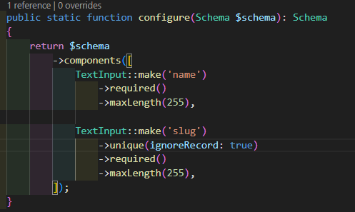

11. change category_id to foreign key 
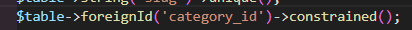

## JOBSHEET 6 = https://github.com/Zuhdiaja/laravel-filament/blob/main/jobhseet6.md