## Jobsheet 6
Muhammad Zuhdi Yudadharma  
244107020017  
TI - 2F

## JOBSHEET Implementasi Form Elements & Resource Post

## langkah-langkah

1. Membuat Resource untuk Post  
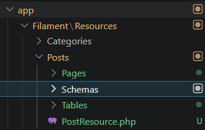

2. implementasi form element  
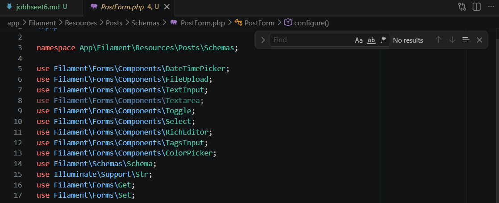
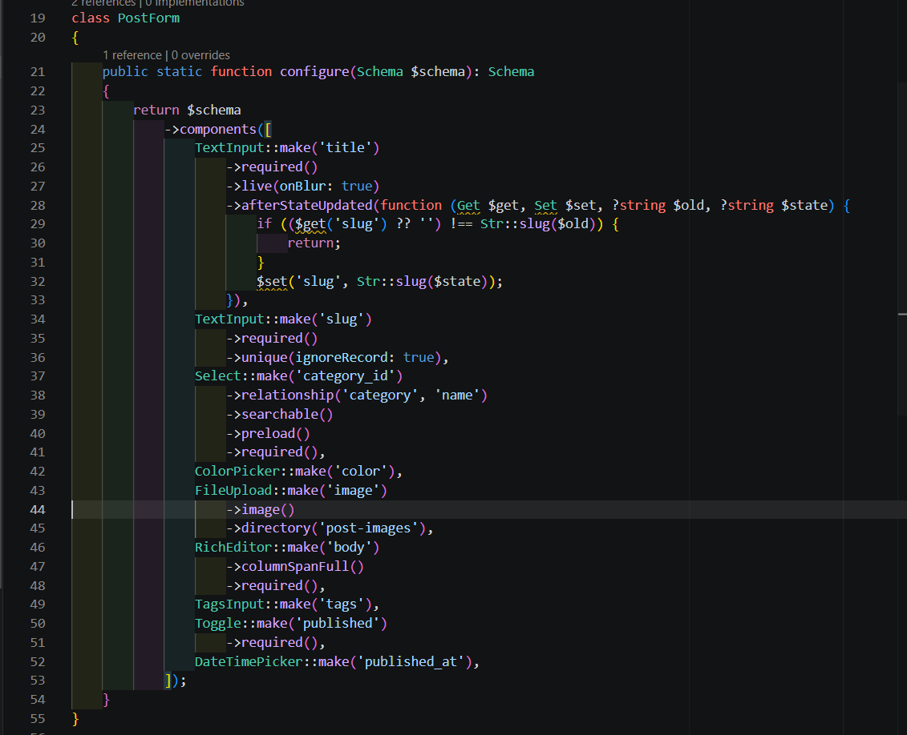

3. hasil tersimpan di   
database 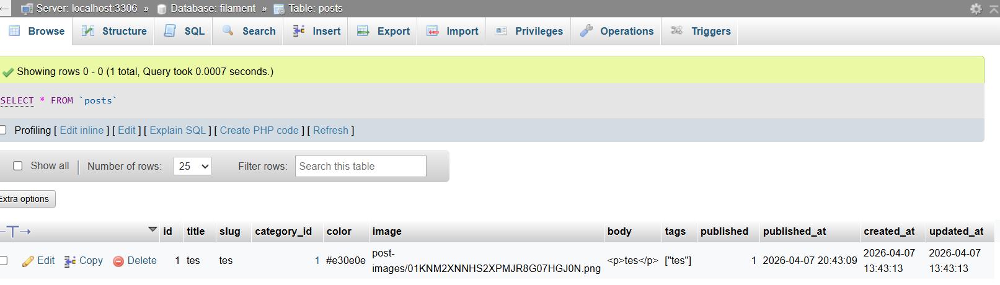  
tampil table 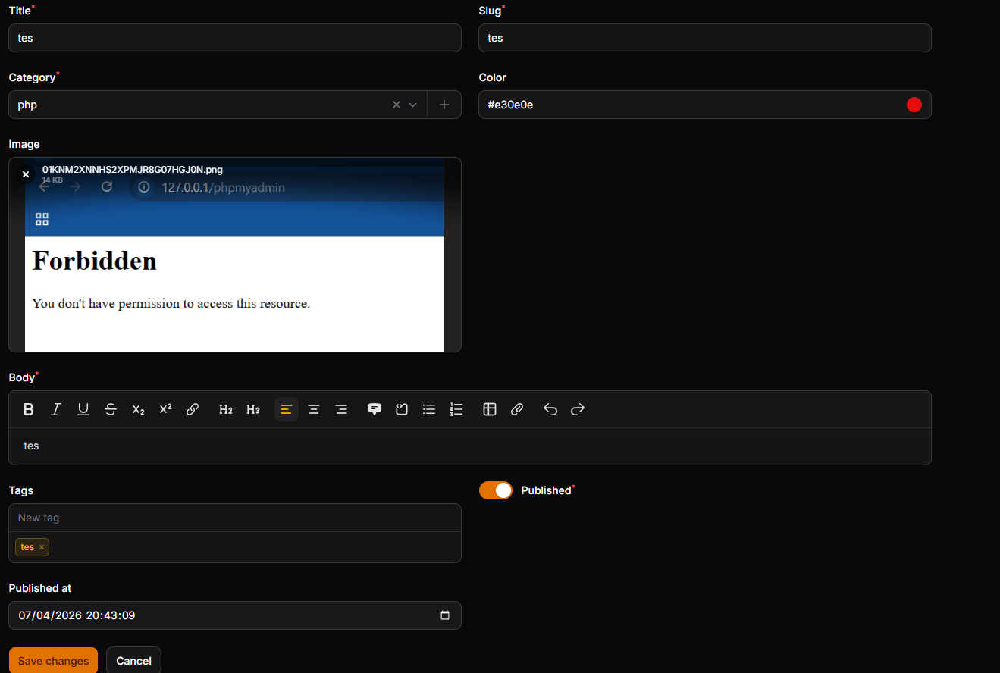
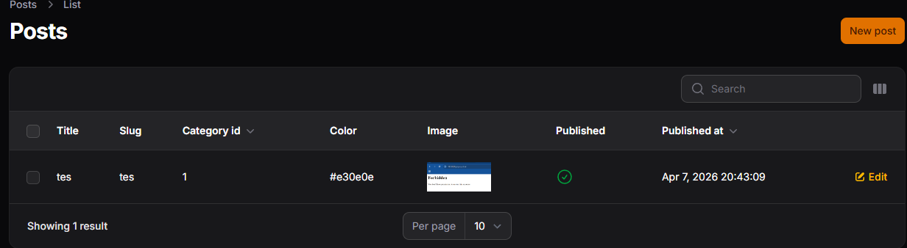  

------------------------------------------------------

## JOBSHEET Membuat CRUD Resource

## langkah-langkah

1. membuat resource user  
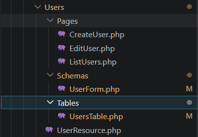

2. tampilan  
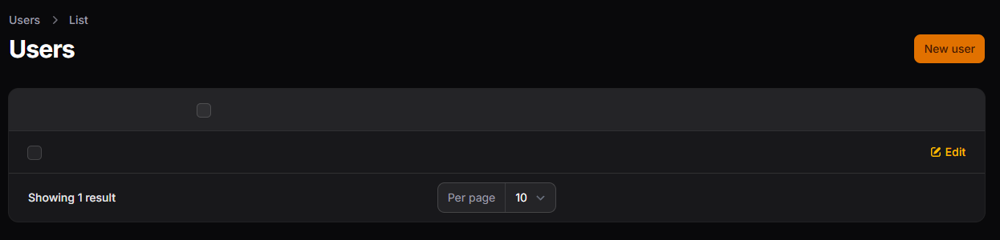

3. form input  
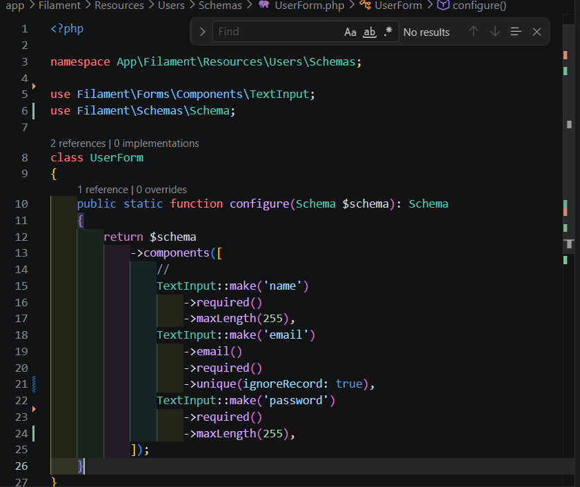
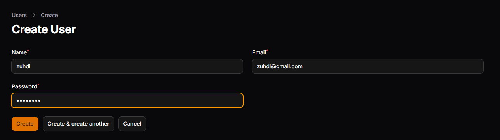

4. view input  
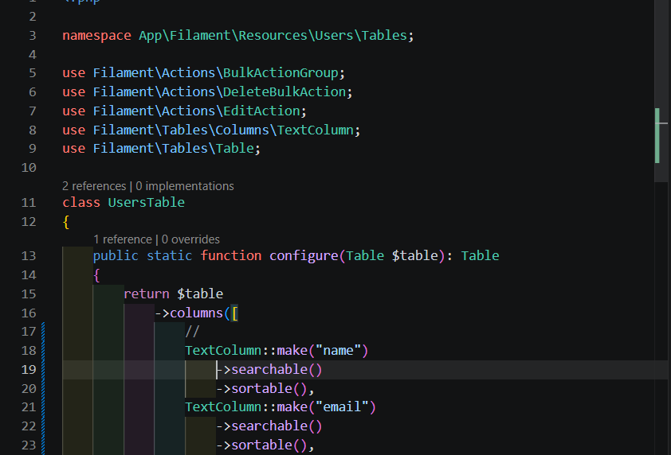
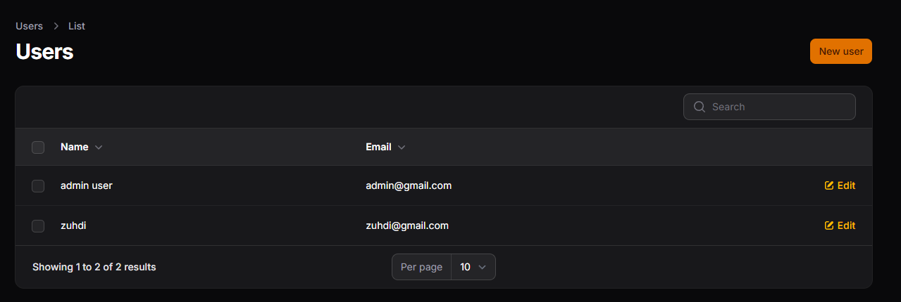

------------------------------------------------------

## JOBSHEET Implementasi Form Validation

## langkah-langkah

1. method required()  
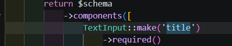

2.  method rule()  
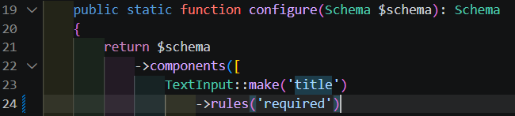
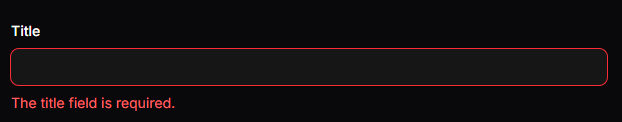

3. methode rules()  
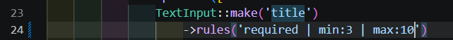
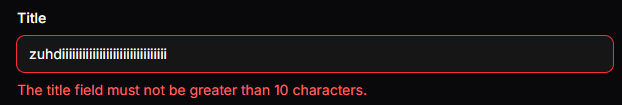

4. format array  
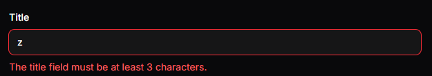

5. validasi unique  

6. custom massage  
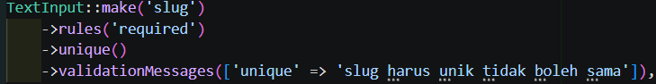
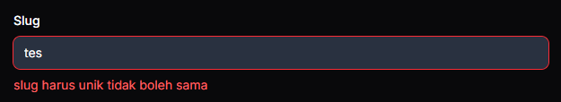
