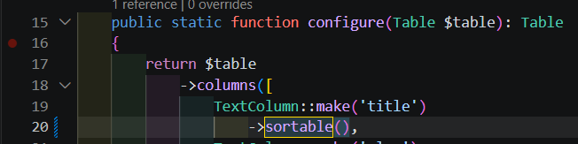
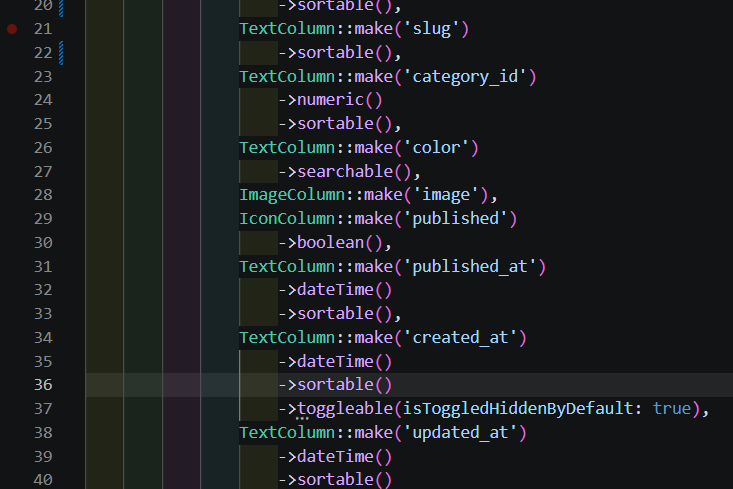
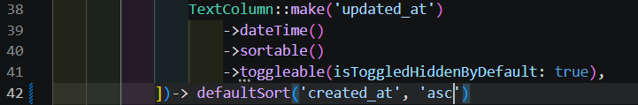
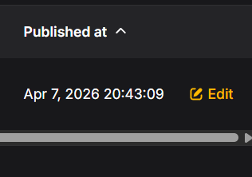

## Jobsheet 10
Muhammad Zuhdi Yudadharma  
244107020017  
TI - 2F

## JOBSHEET – Implementasi Sorting (Ascending & Descending) pada Table Filament

## langkah-langkah

1. Implementasi Sorting pada Kolom Title, slug, category, tanggal  

2. Mengatur Default Sorting 

