## Jobsheet 11
Muhammad Zuhdi Yudadharma  
244107020017  
TI - 2F

## JOBSHEET – Implementasi Search & Filter pada Table Filament

## langkah-langkah

1. Menambahkan Search pada Kolom  
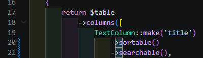
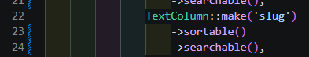
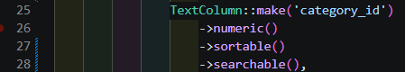

2. hasil view 
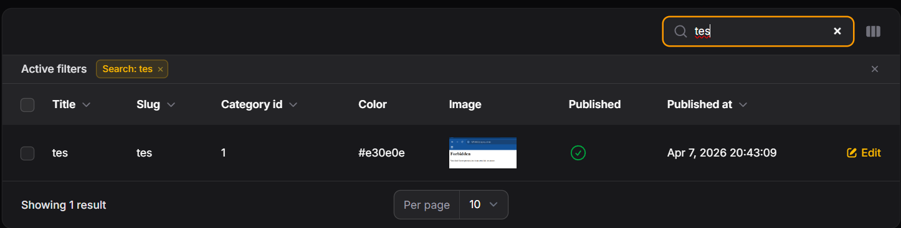
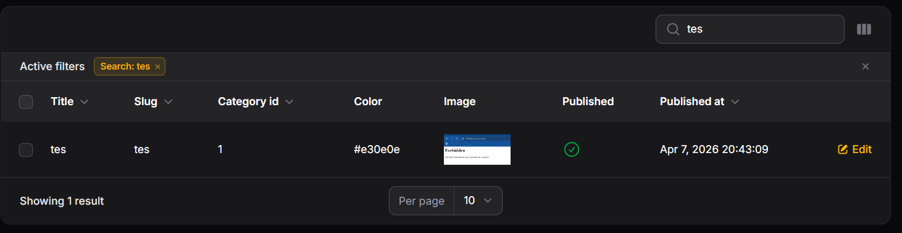
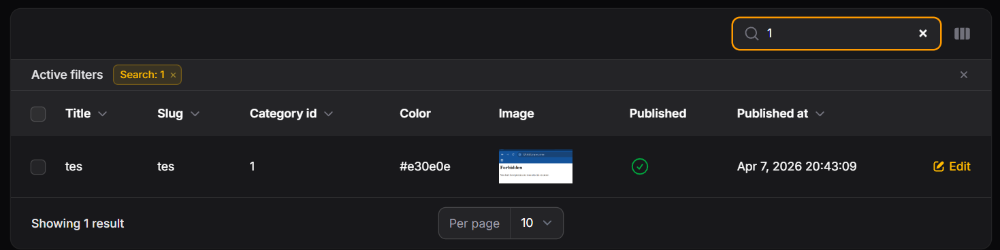

3. Membuat Filter Berdasarkan Tanggal 
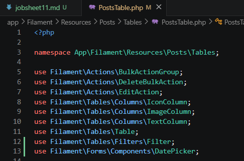
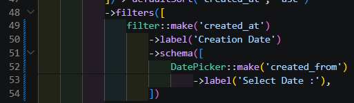
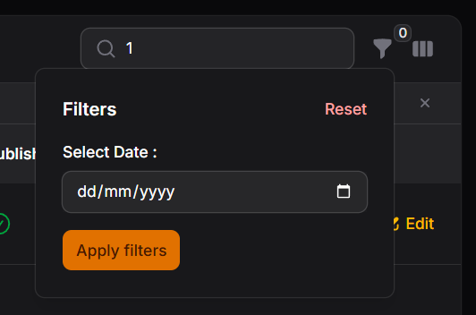

4. Menambahkan Query Logic  
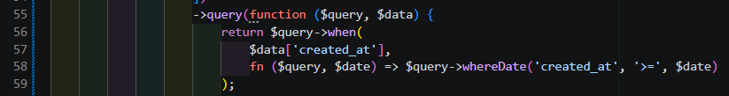
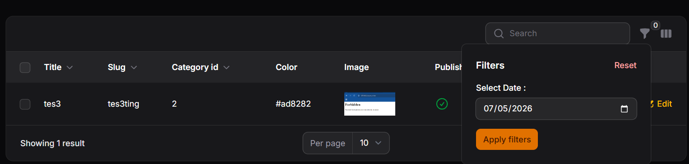

5. Membuat Filter Berdasarkan Relasi (Kategori) 
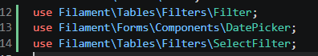
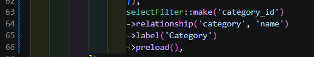
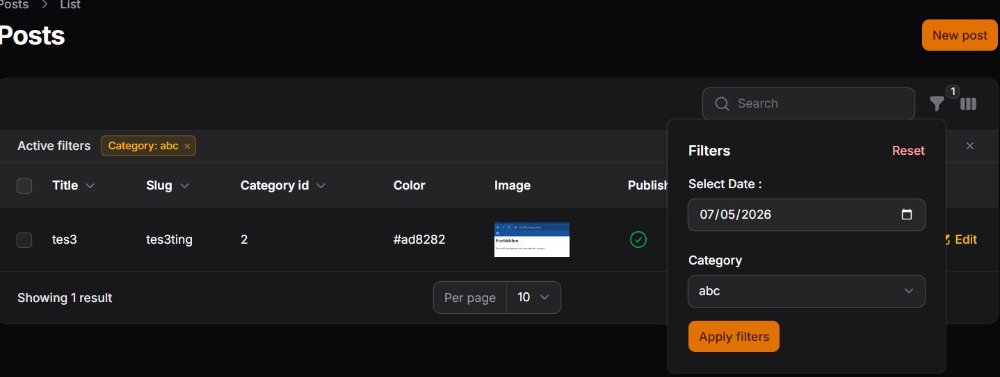

