## Jobsheet 12
Muhammad Zuhdi Yudadharma  
244107020017  
TI - 2F

## JOBSHEET – Implementasi Toggle Column pada Table Filament

## langkah-langkah

1. Menambahkan Kolom Baru ID  
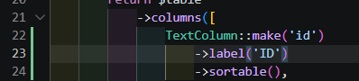
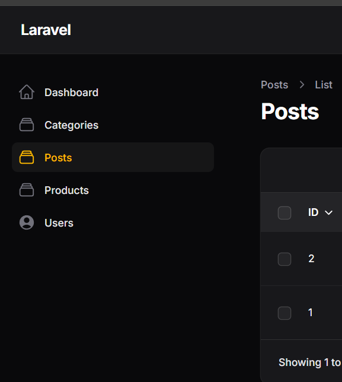

2. Menambahkan Kolom Tags 
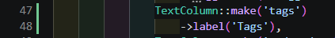
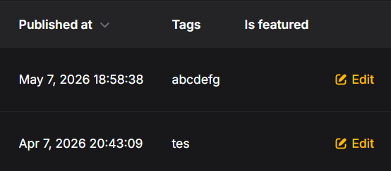

3. Menambahkan Kolom Published (Boolean) 
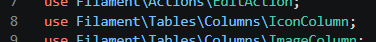
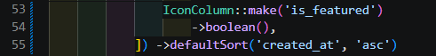
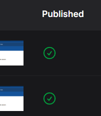

4. Mengaktifkan Toggle Column  
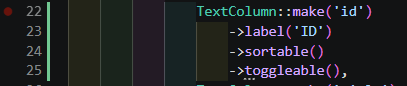
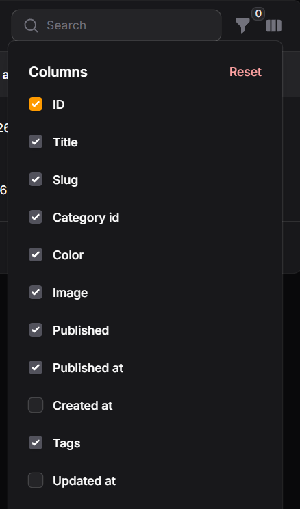

5. Menyembunyikan Kolom Secara Default 
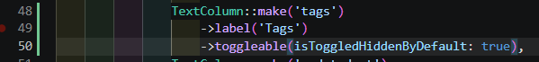
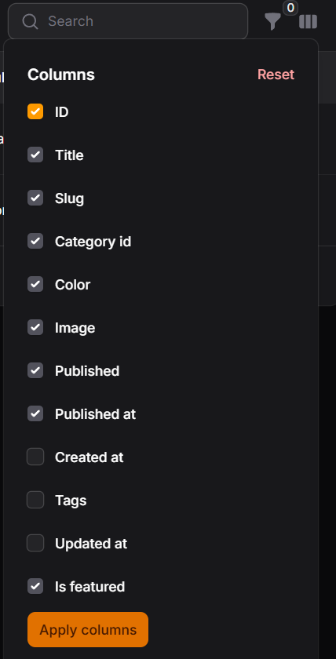

6. Menerapkan Toggle pada Semua Kolom 
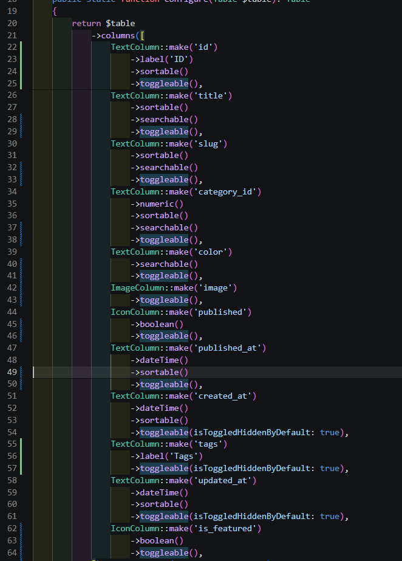
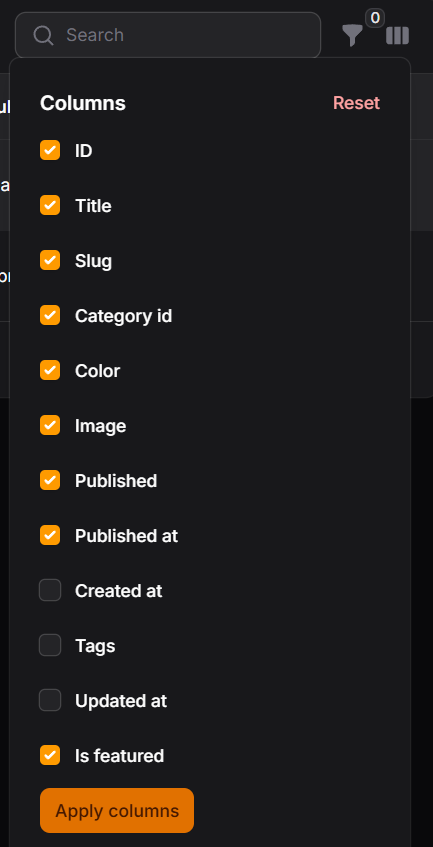
