## Jobsheet 13
Muhammad Zuhdi Yudadharma  
244107020017  
TI - 2F

## JOBSHEET – Implementasi Table Actions & Custom Action di Filament

## langkah-langkah

1. Menambahkan Delete Action  
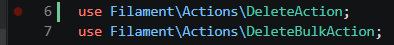
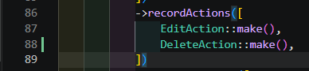
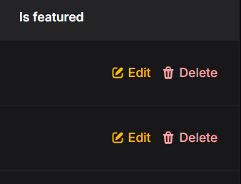

2. Menambahkan Replicate (Copy) Action 
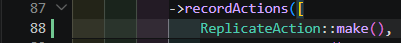
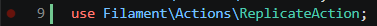
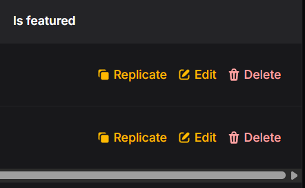

3. Tambahkan Form Input pada Action 
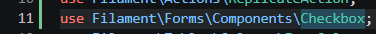
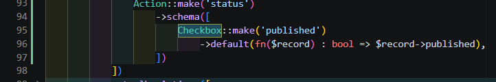
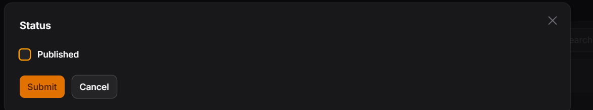

4. Tambahkan Logic untuk Update Data  
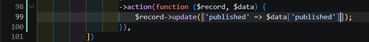

5. Tambahkan Icon 
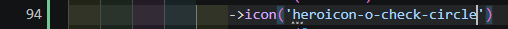
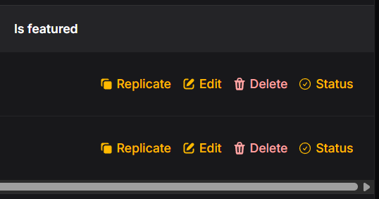
