## Jobsheet 14
Muhammad Zuhdi Yudadharma  
244107020017  
TI - 2F

## JOBSHEET – Implementasi Relation pada Filament (HasMany)

## langkah-langkah

1. Implementasi Relationship pada Form  
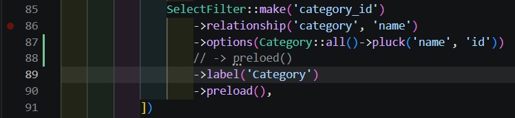

2. Membuat Dropdown Searchable 

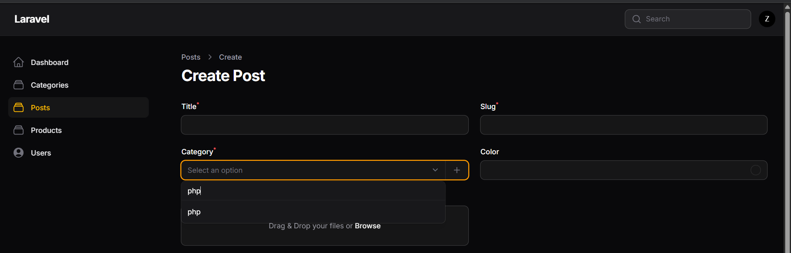

3. Relationship pada Model 
Model Post  
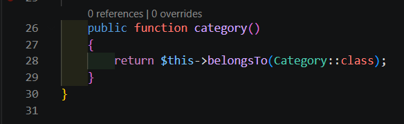 
Model Category 
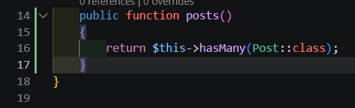

4. Menampilkan Data Relasi pada Table  
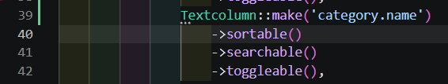

5. Membuat Relationship Manager 
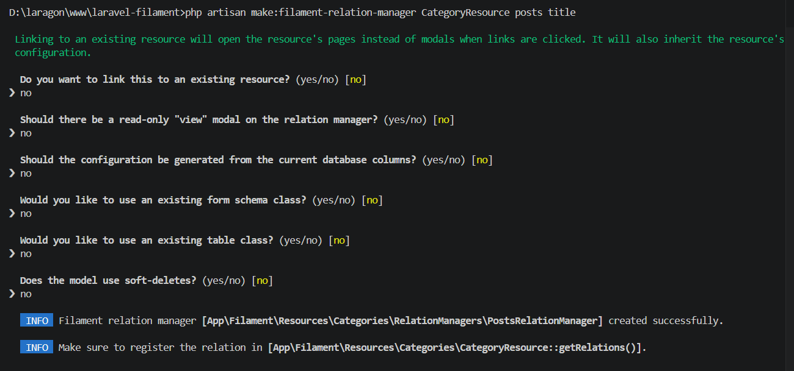

6. Menghubungkan Relationship Manager 
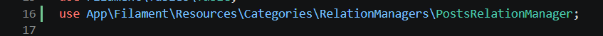
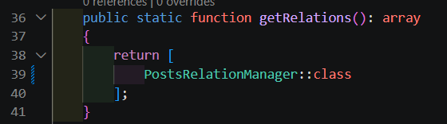

7. Hasil Relationship Manager 
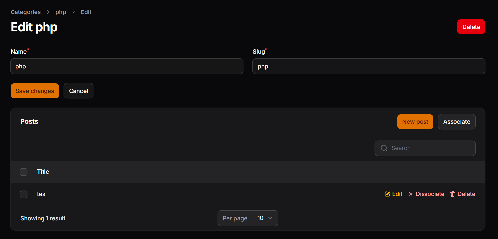

8. Menambahkan Kolom pada Relationship Table 
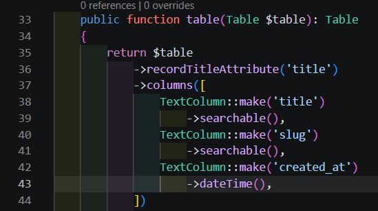 
hasil 
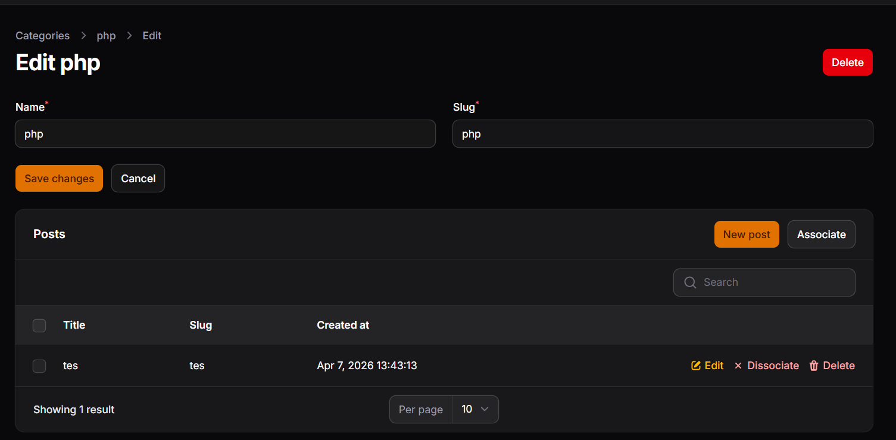

9. Membuat Form Create Post pada Relationship 
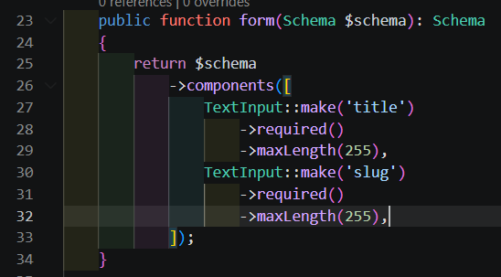
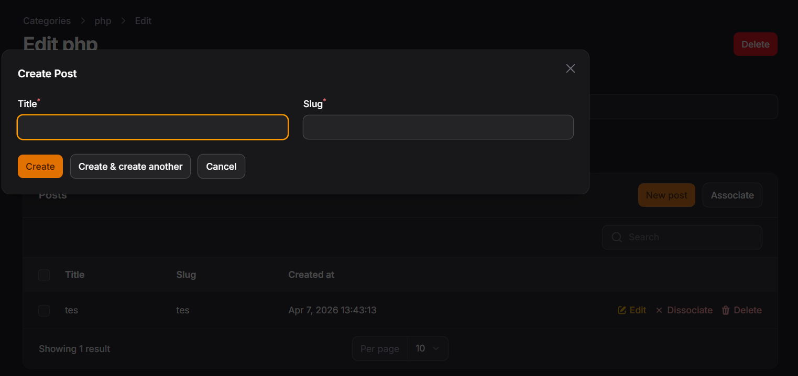

## Analisis & Diskusi
1. Apa perbedaan relationship() dengan options()? 
relationship() mengambil data dinamis langsung dari database, sedangkan options() menggunakan data array statis yang dibuat manual. 

2. Mengapa searchable penting untuk dataset besar? 
Mencegah browser lambat atau crash. Data tidak dimuat semua sekaligus, melainkan dicari ke server hanya sesuai teks yang diketik pengguna. 

3. Apa fungsi Relationship Manager pada Filament? 
Mengelola (tambah/edit/hapus) data anak (child) langsung dari dalam halaman data induknya (parent), tanpa perlu pindah menu. 

4. Kapan menggunakan HasMany dan BelongsTo? 
BelongsTo pada model yang tabelnya menyimpan foreign key (contoh: tabel punya category_id). Gunakan HasMany pada model induk yang memiliki banyak data anak tersebut. 