## Jobsheet 7
Muhammad Zuhdi Yudadharma  
244107020017  
TI - 2F

## JOBSHEET – Implementasi Wizard Form (Multi Step Form) di Filament

## langkah-langkah

1. Membuat file migrate product table dan tampilan d database  
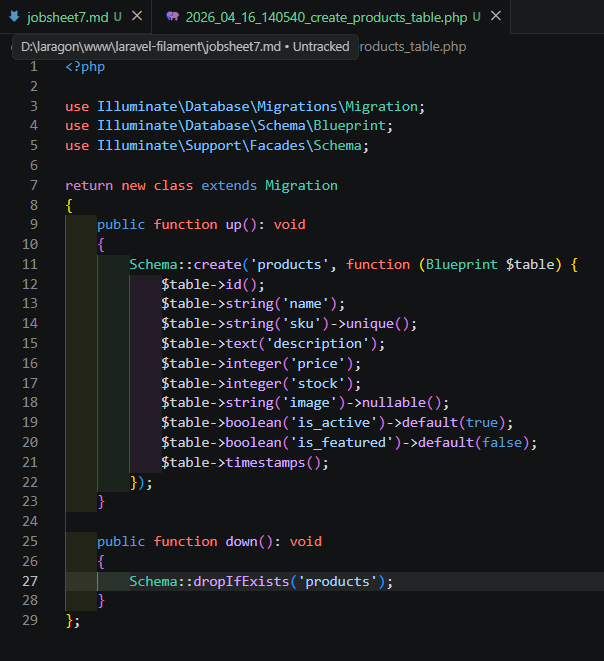
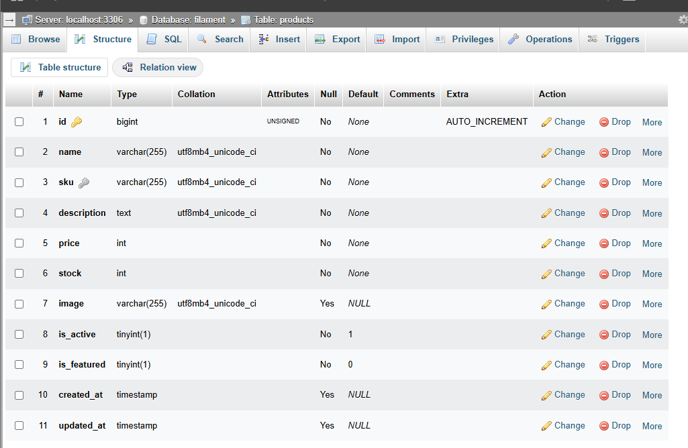

2. membuat file mode product 
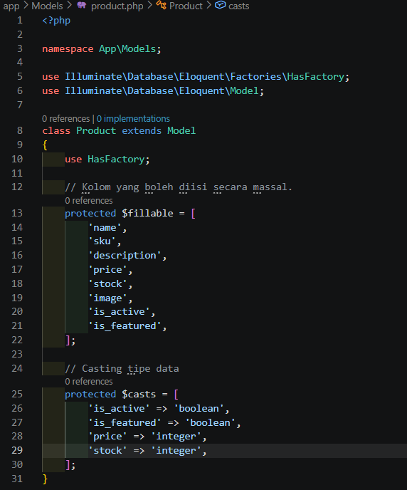

3. membuat resource product dan view 
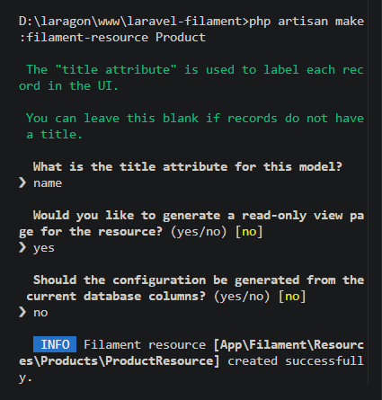
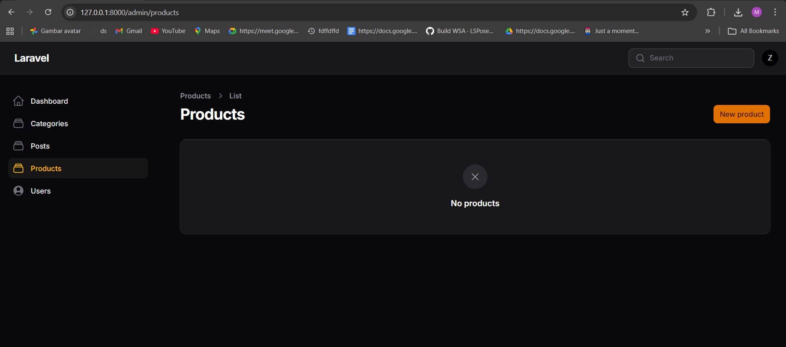

4. Implementasi Wizard Form : Product form 
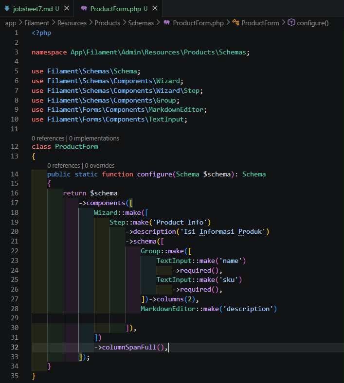
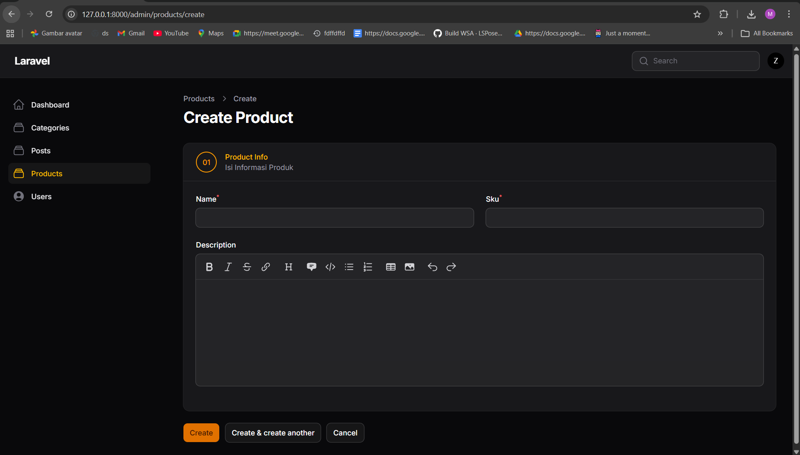

5. Pricing & Stock 
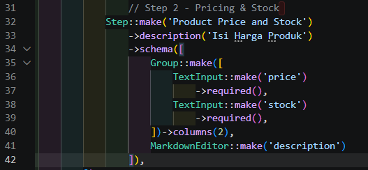
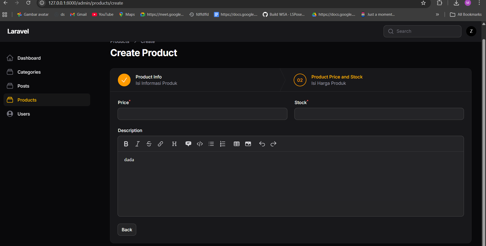

6. media & status 
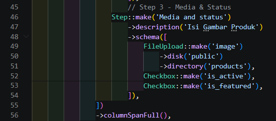

7. manambahkan tombol submit  
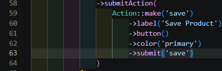
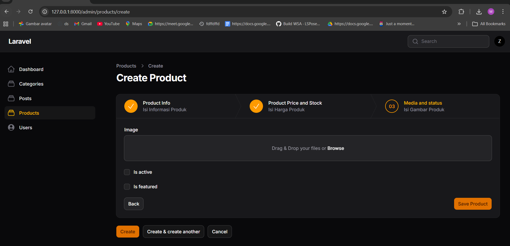

8. Menghilangkan Default Button 
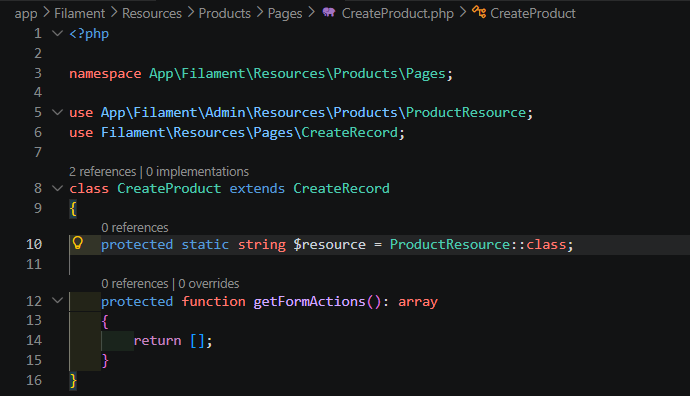
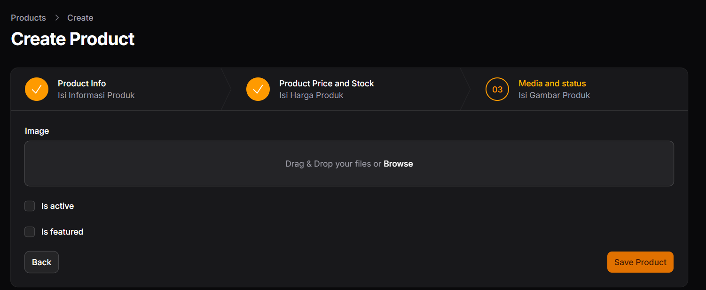

9. Menampilkan Data pada Table 
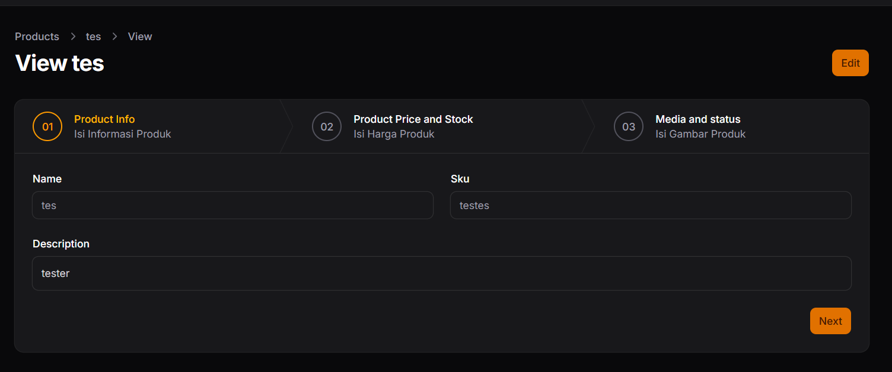
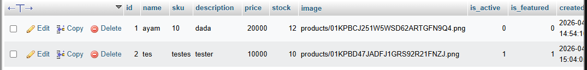

10. menampilkan data pada table 
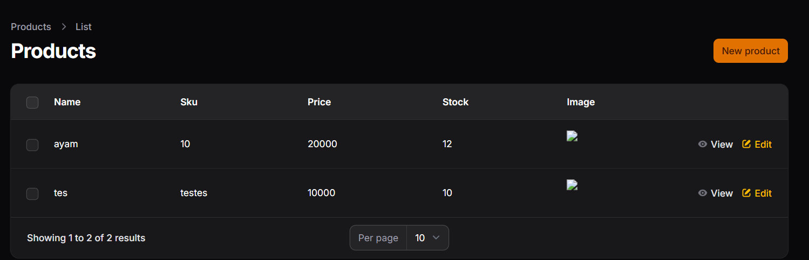